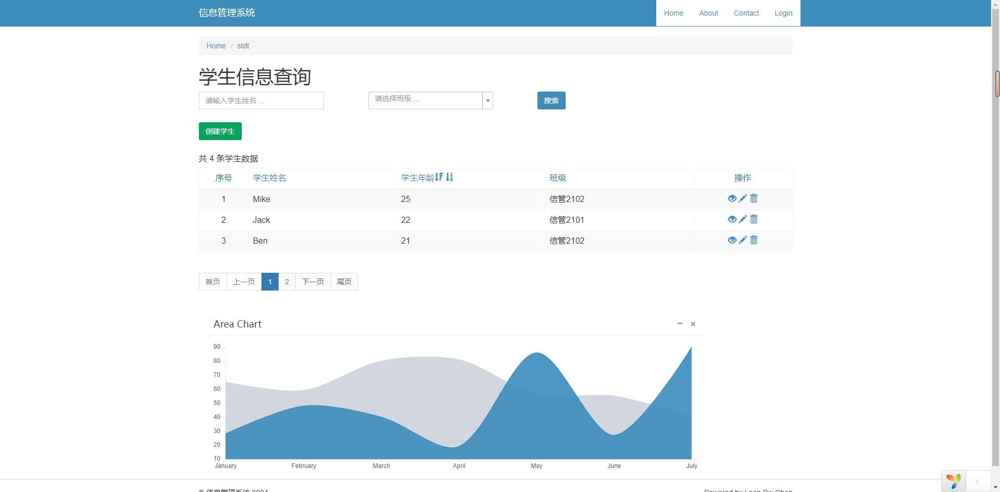

# Wamp + Yii 2 + AdminLTE 
## 数据库系统应用实验作业

----------------------------------
预览
--------------

文件结构
---------------
> 项目包位于\wamp3.2.0\server\www路径下，作为wamp server的应用程序

      assets/             contains assets definition
      commands/           contains console commands (controllers)
      config/             contains application configurations
      controllers/        contains Web controller classes
      mail/               contains view files for e-mails
      models/             contains model classes
      runtime/            contains files generated during runtime
      tests/              contains various tests for the basic application
      vendor/             contains dependent 3rd-party packages
      views/              contains view files for the Web application
      web/                contains the entry script and Web resources

运行环境
---------------
        "php": ">=5.4.0",
        "yiisoft/yii2": "~2.0.5",
        "yiisoft/yii2-bootstrap": "~2.0.0",
        "yiisoft/yii2-swiftmailer": "~2.0.0",
        "kartik-v/yii2-widgets": "dev-master",
        "kartik-v/yii2-grid": "dev-master",
        "almasaeed2010/adminlte": "v2.4.3"